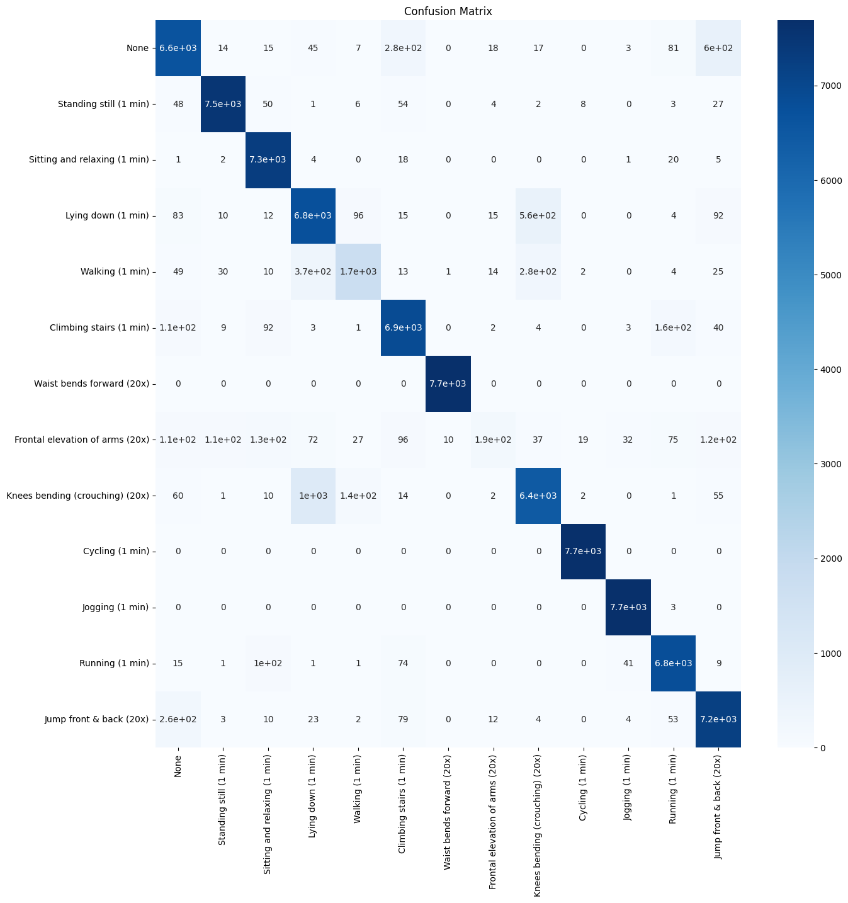
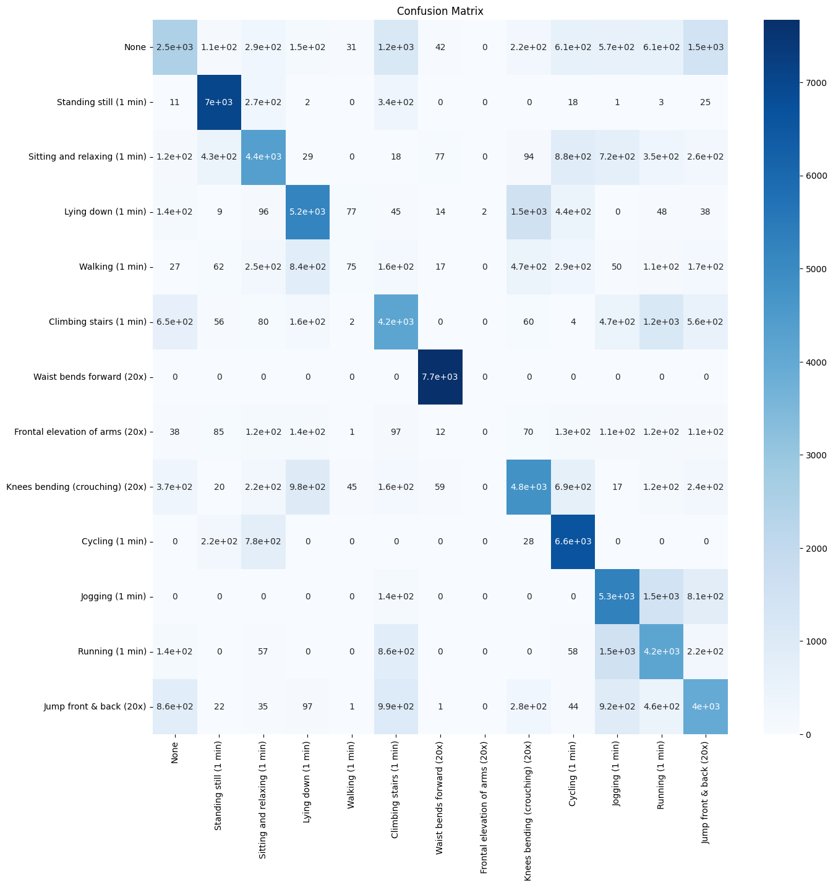

# Human Behavior Classification using Mobile Health Data

Achieved **97.11% accuracy** using KNN on real-world wearable sensor data.


---

## Overview

This project focuses on classifying human activities using wearable sensor data. Multiple machine learning models were implemented and compared to identify the most effective approach for activity recognition.

---

## Dataset

* Source: https://www.kaggle.com/datasets/gaurav2022/mobile-health
* Data includes:

  * Accelerometer readings
  * Gyroscope data
  * Physiological signals

> ⚠️ Dataset is not included in this repository due to size constraints. Please download it from the link above.

---

## Problem Statement

Predict human activity based on sensor data collected from mobile health monitoring systems.

---

## Approach

### Data Preprocessing

* Cleaned dataset and handled inconsistencies
* Applied **StandardScaler for feature normalization** (critical for KNN performance)
* Performed train-test split (`test_size=0.2`, `random_state=42`, stratified)

---

## Model Performance Comparison

| Model               | Accuracy   | Precision | Recall | F1-Score |
| ------------------- | ---------- | --------- | ------ | -------- |
| KNN (k=1)           | **0.9711** | 0.9531    | 0.9280 | 0.9371   |
| KNN (k=2)           | 0.9672     | 0.9479    | 0.9170 | 0.9267   |
| KNN (k=3)           | 0.9703     | 0.9677    | 0.9182 | 0.9308   |
| Decision Tree       | 0.9195     | 0.8872    | 0.8636 | 0.8702   |
| Logistic Regression | ~0.64      | —         | —      | —        |

---

## Key Results

* **Best Model: KNN (k=1)** with **97.11% accuracy**
* Logistic Regression underperformed due to linear limitations
* Decision Tree showed moderate performance but lower accuracy than KNN

---

## Confusion Matrix

### KNN (Best Model)



* Strong diagonal dominance → high correct classification
* Excellent performance on:

  * Cycling
  * Jogging
  * Standing still
* Minor confusion between:

  * Walking vs Lying down
  * Dynamic activities (jumping, climbing stairs)

---

### Logistic Regression



* Weak diagonal dominance → high misclassification
* Struggles with:

  * Similar activities (sitting, walking, lying)
  * Dynamic motion patterns
* Indicates data is **non-linearly separable**

---

## Why KNN Performs Better

* Works on **distance-based similarity**
* Captures non-linear relationships in sensor data
* Benefits significantly from feature scaling

---

## Evaluation Metrics

* Accuracy
* Precision
* Recall
* F1-score
* Confusion Matrix

---

## Tech Stack

* Python
* NumPy, Pandas
* Scikit-learn
* Matplotlib, Seaborn

---

## How to Run

```bash
git clone https://github.com/priyanshu015211/human-behavior-classification.git
cd human-behavior-classification
pip install -r requirements.txt
```

### Run Notebook

```bash
jupyter notebook
```

### Run Python Script

```bash
python human_behavior_classification.py
```

---

## Project Structure

```
├── human_behavior_classification.ipynb
├── human_behavior_classification.py
├── README.md
├── requirements.txt
├── knn_confusion_matrix.png
├── lr_confusion_matrix.png
└── dataset/   (download separately)
```

---

## Highlights

* Achieved **97%+ accuracy** on multi-class classification
* Compared linear vs non-linear models
* Performed hyperparameter tuning (K optimization)
* Analyzed model performance using confusion matrices

---

## Key Learnings

* Importance of feature scaling in ML models
* Model selection based on data complexity
* Hyperparameter tuning (K optimization in KNN)
* Evaluating models using multiple metrics

---

## Future Improvements

* Cross-validation for more robust evaluation
* Ensemble models (Random Forest, XGBoost)
* Deep learning approaches (LSTM for time-series data)
* Real-time activity prediction system

---

## Author

Priyanshu Bhagat
